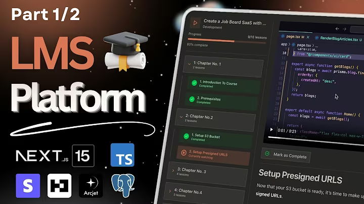

# 📚 LMS - Learning Management System

A full-stack **Learning Management System (LMS)** built with the **MERN stack**.  
This platform helps schools, coaching centers, and online educators manage courses, students, and content efficiently.

  
*Screenshot of the LMS dashboard and main interface.*

---

## 🛠️ Tech Stack

**Frontend:**  
- React.js  
- Tailwind CSS / SCSS  
- React Router DOM  

**Backend:**  
- Node.js  
- Express.js  
- MongoDB + Mongoose  
- JWT Authentication  

---

## 🚀 How It Works

- Users can **register and login** with role-based access (Admin, Instructor, Student).  
- Admins can **manage courses, users, and analytics**.  
- Instructors can **upload course content** including videos, quizzes, and assignments.  
- Students can **enroll in courses, track progress, and access learning materials**.  

---

## 👨‍💻 Developer

**Vishal Singh**  
[GitHub](https://github.com/thevishingh) | [Website](https://mentationtech.in/)

